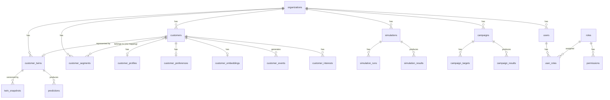
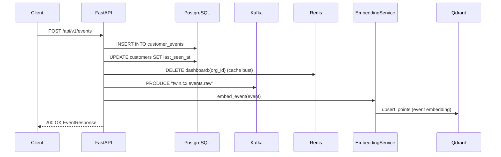
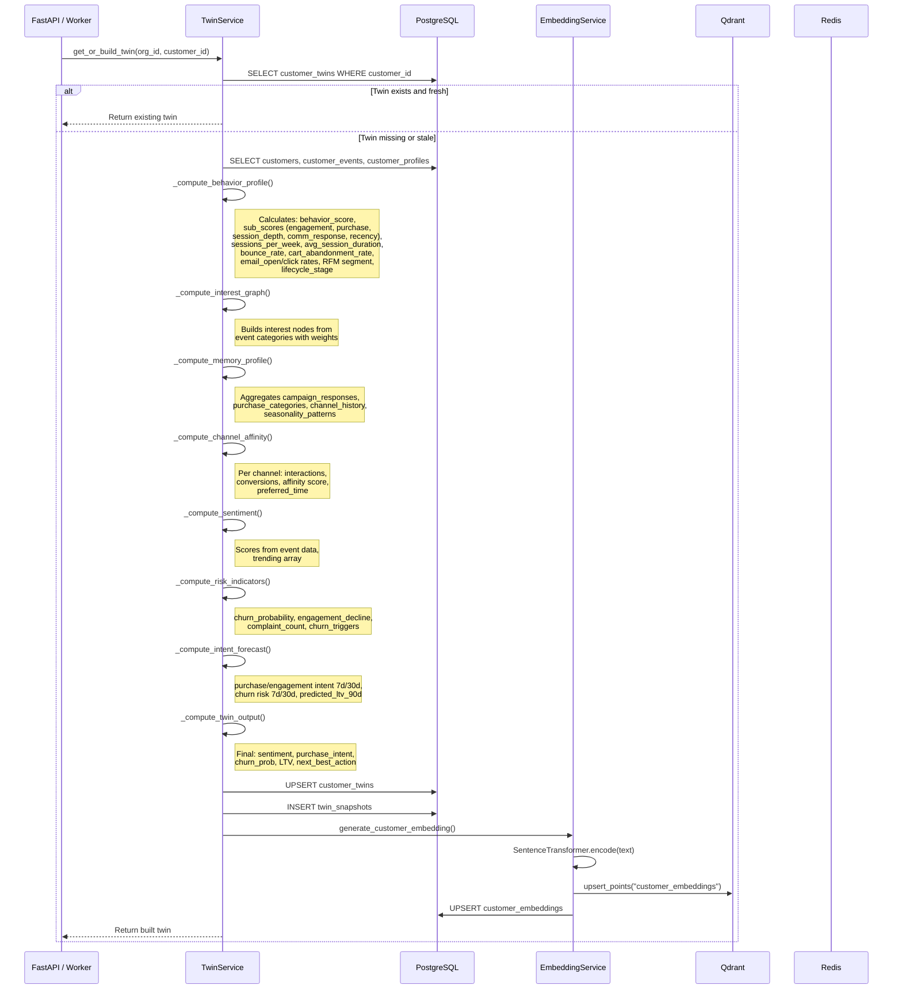
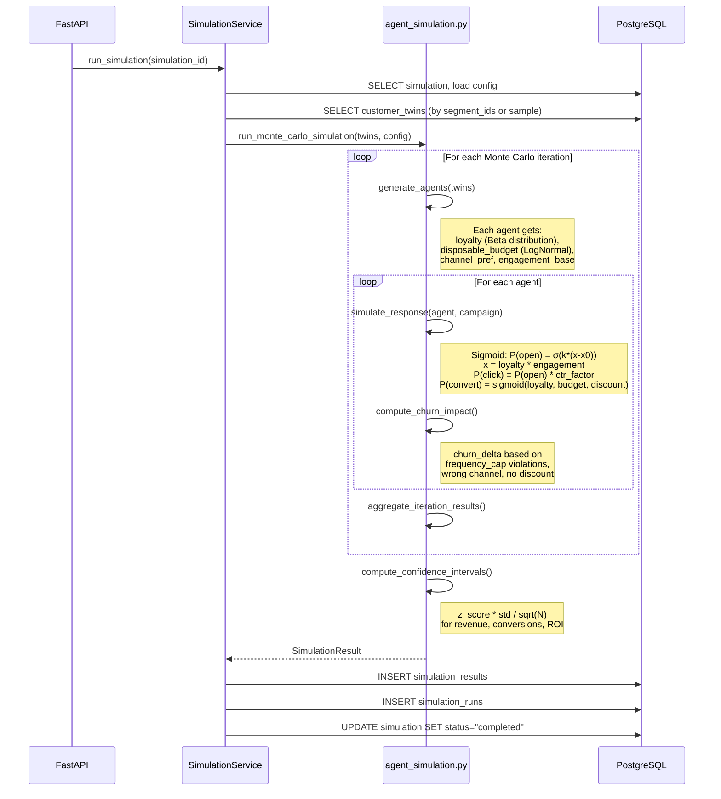
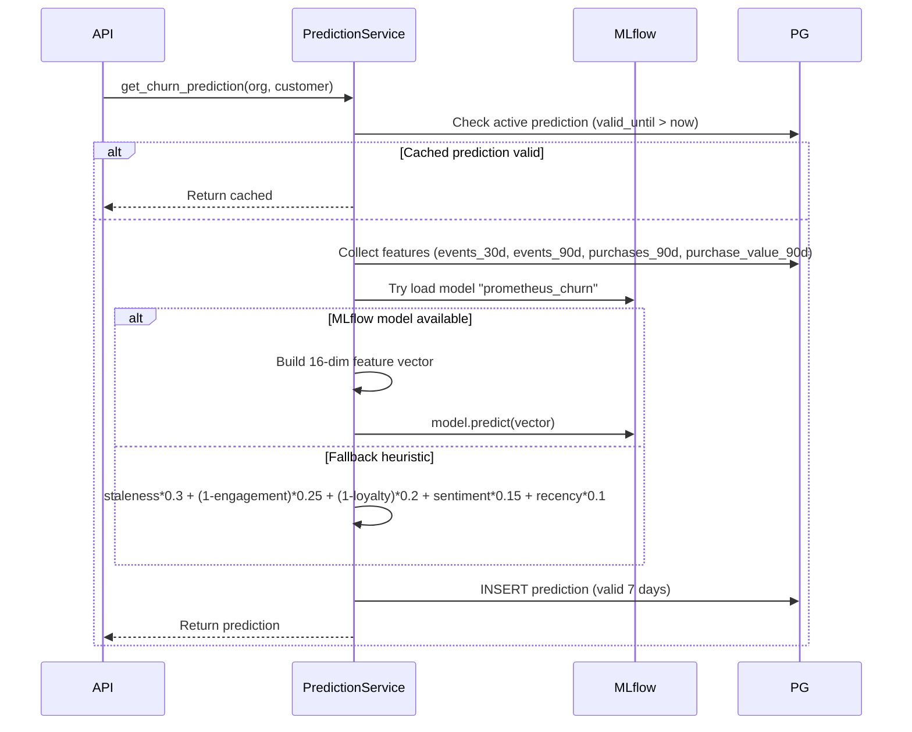
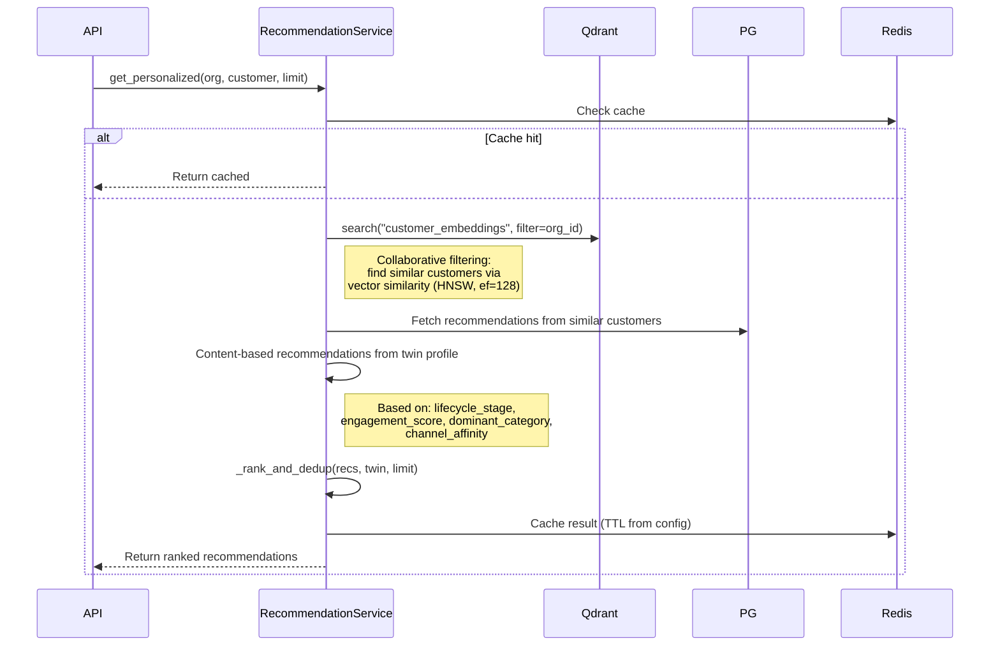

# Prometheus (TwinCX) — System Architecture

> **Source:** This document is derived entirely from reading the source code. No existing markdown documentation was used.

---

## 1. System Overview

Prometheus (internally branded **TwinCX**) is a **Digital Twin Customer Experience Platform**. It creates virtual representations ("twins") of real customers by aggregating behavioral data, runs Monte Carlo simulations to predict campaign outcomes, and provides AI-driven recommendations and churn predictions.

### High-Level Component Map

```mermaid
graph TD
    subgraph "Frontend — React SPA"
        FE["Vite + React 18 + TypeScript"]
        FE --> Dashboard["Dashboard Page"]
        FE --> TwinExplorer["Twin Explorer Page"]
        FE --> SimLab["Simulation Lab Page"]
        FE --> ScenarioComp["Scenario Comparison Page"]
    end

    subgraph "Backend — FastAPI"
        API["FastAPI uvicorn (port 8000)"]
        API --> AuthRouter["/api/v1/auth"]
        API --> CustRouter["/api/v1/customers"]
        API --> TwinRouter["/api/v1/twins"]
        API --> SimRouter["/api/v1/simulations"]
        API --> EventRouter["/api/v1/events"]
        API --> AnalyticsRouter["/api/v1/analytics"]
        API --> CampRouter["/api/v1/campaigns"]
        API --> RecRouter["/api/v1/recommendations"]
        API --> NotifRouter["/api/v1/notifications"]
        API --> SegRouter["/api/v1/segments"]
        API --> UserRouter["/api/v1/users"]
        API --> AdminRouter["/api/v1/admin"]
    end

    subgraph "Background Workers (Kafka Consumers)"
        TwinBuilder["twin_builder.py"]
        SimWorker["simulation_worker.py"]
        PredWorker["prediction_worker.py"]
        NotifWorker["notification_worker.py"]
    end

    subgraph "Data Stores"
        PG["PostgreSQL 16"]
        Redis["Redis 7"]
        Qdrant["Qdrant 1.7+"]
        Kafka["Apache Kafka (KRaft)"]
    end

    API --> PG
    API --> Redis
    API --> Qdrant
    API --> Kafka
    TwinBuilder --> PG
    TwinBuilder --> Qdrant
    TwinBuilder --> Redis
    SimWorker --> PG
    PredWorker --> PG
    NotifWorker --> PG
```



---

## 2. Technology Stack (From Code)

### 2.1 Backend

| Component | Technology | Version / Source |
|---|---|---|
| **Web Framework** | FastAPI | `requirements.txt` |
| **ASGI Server** | Uvicorn | `uvicorn[standard]` |
| **ORM** | SQLAlchemy 2.x (async) | `sqlalchemy[asyncio]` |
| **DB Driver** | asyncpg | `asyncpg` (PostgreSQL async driver) |
| **Database** | PostgreSQL 16 | `docker-compose.yml` image: `postgres:16-alpine` |
| **Cache** | Redis 7 | `docker-compose.yml` image: `redis:7-alpine` |
| **Message Broker** | Apache Kafka (KRaft mode) | `bitnami/kafka:latest` |
| **Vector Database** | Qdrant | `qdrant/qdrant:latest` |
| **Embedding Model** | SentenceTransformers (`all-MiniLM-L6-v2`) | `embedding_service.py` L27 |
| **ML Models** | MLflow (optional), scikit-learn KMeans, joblib | `prediction_service.py`, `segment_service.py` |
| **Auth / JWT** | python-jose (HS256), bcrypt | `security.py` |
| **MFA** | pyotp (TOTP) | `auth_service.py` |
| **Kafka Client** | aiokafka | `kafka.py` |
| **Qdrant Client** | qdrant-client (AsyncQdrantClient) | `qdrant.py` |
| **Redis Client** | redis.asyncio | `redis.py` |
| **Config** | pydantic-settings (`.env` files) | `config.py` |
| **Logging** | structlog | `logging.py` |
| **Migrations** | Alembic | `alembic/` directory |
| **Validation** | Pydantic v2 | `schemas/*.py` |

### 2.2 Frontend

| Component | Technology | Version |
|---|---|---|
| **Framework** | React 18 | `^18.3.1` |
| **Build Tool** | Vite 5 | `^5.4.10` |
| **Language** | TypeScript 5.6 | `^5.6.3` |
| **State Management** | Zustand 5 | `^5.0.0` |
| **Data Fetching** | TanStack React Query 5 | `^5.59.16` |
| **HTTP Client** | Axios | `^1.7.7` |
| **Routing** | React Router DOM 6 | `^6.27.0` |
| **CSS Framework** | Tailwind CSS 3 | `^3.4.14` |
| **UI Components** | Radix UI primitives | Dialog, Dropdown, Select, Tabs, etc. |
| **Charts** | Recharts 2 | `^2.13.0` |
| **Icons** | Lucide React | `^0.453.0` |
| **Forms** | React Hook Form + Zod | `^7.53.0` / `^3.23.8` |

### 2.3 Infrastructure (Docker Compose)

| Service | Image | Port |
|---|---|---|
| `postgres` | `postgres:16-alpine` | 5432 |
| `redis` | `redis:7-alpine` | 6379 |
| `kafka` | `bitnami/kafka:latest` | 9092 |
| `qdrant` | `qdrant/qdrant:latest` | 6333 (HTTP), 6334 (gRPC) |
| `backend` | Custom Dockerfile | 8000 |
| `frontend` | Custom Dockerfile | 5173 |

---

## 3. Database Schema (From SQLAlchemy Models)

### 3.1 Core Domain Tables



### 3.2 Table-by-Table Definition

#### `organizations`
Multi-tenant root entity. Every data row is scoped by `organization_id`.

| Column | Type | Description |
|---|---|---|
| `id` | UUID (PK) | Auto-generated |
| `name` | String(255) | Organization display name |
| `slug` | String(100) UNIQUE | URL-safe identifier |
| `domain` | String(255) | Org domain |
| `logo_url` | Text | Logo URL |
| `plan` | String(50) | Subscription plan (default: "enterprise") |
| `settings` | JSONB | Org-level settings |
| `features` | JSONB | Feature flags |
| `max_customers` | Integer | Customer cap (default: 100,000) |
| `max_users` | Integer | User cap (default: 100) |
| `is_active` | Boolean | Active status |
| `trial_ends_at` | DateTime | Trial expiry |

#### `users`
Platform users (operators, not end-customers).

| Column | Type | Description |
|---|---|---|
| `id` | UUID (PK) | |
| `organization_id` | UUID (FK → organizations) | |
| `email` | String(255) | Login email |
| `password_hash` | String(255) | bcrypt hash |
| `first_name`, `last_name` | String(100) | Name fields |
| `is_active` | Boolean | Active flag |
| `is_verified` | Boolean | Email verified |
| `mfa_enabled` | Boolean | MFA activated |
| `mfa_secret` | Text | TOTP secret |
| `last_login_at` | DateTime | Last login timestamp |
| `failed_login_attempts` | Integer | Brute-force counter |
| `locked_until` | DateTime | Account lockout until |
| `reset_token` | String(255) | Password reset token |

#### `customers`
End-customers whose behavior is tracked. Has ~30+ columns including:

| Column | Type | Description |
|---|---|---|
| `id` | UUID (PK) | |
| `organization_id` | UUID (FK) | |
| `external_id` | String(255) UNIQUE | External system identifier |
| `email`, `phone` | String | Contact info |
| `first_name`, `last_name` | String(100) | |
| `date_of_birth` | Date | |
| `gender` | String(20) | |
| `timezone`, `locale` | String | |
| `location` | JSONB | `{city, state, country, lat, lng}` |
| `tags` | ARRAY(String) | Freeform tags |
| `custom_attributes` | JSONB | Extensible key-value |
| `is_active` | Boolean | Soft delete |
| `consent_marketing/analytics/profiling` | Boolean | GDPR consent flags |
| `source` | String(100) | Acquisition channel |
| `first_seen_at`, `last_seen_at` | DateTime | Activity window |
| `acquisition_channel` | String(100) | |
| `total_revenue` | Numeric(14,2) | Lifetime spend |
| `total_orders` | Integer | Order count |
| `avg_order_value` | Numeric(14,2) | |

#### `customer_events` (Range-Partitioned by `event_timestamp`)

| Column | Type | Description |
|---|---|---|
| `id` | UUID | |
| `customer_id` | UUID (FK) | |
| `organization_id` | UUID (FK) | |
| `event_type` | String(100) | e.g. "page_view", "purchase", "email_open" |
| `event_name` | String(255) | Human-readable name |
| `event_properties` | JSONB | Arbitrary payload |
| `context` | JSONB | Contextual metadata |
| `channel` | String(50) | web, mobile, email, etc. |
| `source` | String(50) | |
| `device_type/os/browser` | String | Device info |
| `ip_address` | INET | |
| `url`, `referrer` | Text | Page context |
| `geolocation` | JSONB | `{lat, lng, city, country}` |
| `campaign_id` | UUID | Attribution |
| `value` | Float | Monetary value |
| `currency` | String(3) | ISO currency |
| `processed` | Boolean | Whether twin was updated |
| `idempotency_key` | String(255) UNIQUE (conditional) | De-duplication |
| `event_timestamp` | DateTime | When event occurred |
| `ingested_at` | DateTime | When system received it |

> **Partitioning**: `postgresql_partition_by: RANGE (event_timestamp)` — the events table is range-partitioned for time-series query performance.

#### `customer_twins`
The digital twin — a real-time computed behavioral profile.

| Column | Type | Description |
|---|---|---|
| `id` | UUID (PK) | |
| `customer_id` | UUID (FK) UNIQUE per org | 1:1 with customer |
| `organization_id` | UUID (FK) | |
| `status` | String(50) | `building`, `built`, `active`, `error`, `stale` |
| `version` | Integer | Incremented on rebuild |
| `behavior_profile` | JSONB | `{behavior_score, sub_scores: {engagement, purchase_activity, session_depth, communication_response, recency}, sessions_per_week, avg_session_duration, ...}` |
| `interest_graph` | JSONB | `{nodes: [{name, weight}], dominant_category, interest_diversity}` |
| `memory_profile` | JSONB | `{campaign_responses, purchase_categories, channel_history, discount_sensitivity, seasonality_patterns}` |
| `channel_affinity` | JSONB | `{email: {affinity, interactions}, sms: {...}, push: {...}, in_app: {...}}` |
| `engagement_score` | Float | 0.0–1.0 (or 0–100, scaled) |
| `loyalty_score` | Float | 0.0–1.0 |
| `lifetime_value` | Float | Monetary LTV |
| `sentiment_trend` | JSONB (array) | List of sentiment scores over time |
| `intent_forecast` | JSONB | `{purchase_intent_7d/30d, engagement_intent_7d/30d, churn_risk_7d/30d, predicted_ltv_90d}` |
| `risk_indicators` | JSONB | `{churn_probability, churn_risk_level, churn_triggers, engagement_decline_rate, ...}` |
| `twin_output` | JSONB | `{sentiment, purchase_intent, churn_probability, lifetime_value, next_best_action}` |
| `communication_preferences` | JSONB | |
| `confidence_score` | Float | How reliable the twin is |
| `staleness_score` | Float | How outdated the twin is |
| `embedding_id` | UUID | FK to Qdrant point |
| `rfm_segment` | String(50) | RFM classification |
| `lifecycle_stage` | String(50) | e.g. "new", "engaged", "at_risk", "churned" |
| `built_at` | DateTime | Last full build timestamp |
| `last_event_at` | DateTime | Most recent event processed |
| `last_prediction_at` | DateTime | |

#### `simulations`

| Column | Type | Description |
|---|---|---|
| `id` | UUID (PK) | |
| `organization_id` | UUID (FK) | |
| `name` | String(255) | Simulation name |
| `description` | Text | |
| `type` | String(100) | "campaign", "pricing", "churn", etc. |
| `status` | String(50) | `draft`, `pending`, `running`, `completed`, `failed` |
| `campaign_id` | UUID (FK) | Optional campaign to simulate |
| `configuration` | JSONB | General config |
| `parameters` | JSONB | Simulation-specific params |
| `agent_configuration` | JSONB | Agent behavior overrides |
| `monte_carlo_iterations` | Integer | MC iterations (default: 1000) |
| `confidence_level` | Float | Statistical confidence (default: 0.95) |
| `time_horizon_days` | Integer | Forecast window (default: 30) |
| `segment_ids` | ARRAY(String) | Target segments |
| `sample_size` | Integer | Max agents (default: 10,000) |
| `include_control` | Boolean | Include control group |
| `expected_outputs` | ARRAY(String) | Requested output metrics |
| `progress` | Float | 0.0–100.0 |
| `started_at`, `completed_at` | DateTime | |

#### `simulation_results`

| Column | Type | Description |
|---|---|---|
| `aggregated_metrics` | JSONB | `{total_opens, total_clicks, total_conversions, total_revenue, avg_open_rate, ...}` |
| `customer_projections` | JSONB | Per-customer predicted outcomes |
| `segment_projections` | JSONB | Per-segment projections |
| `campaign_impact` | JSONB | Impact breakdown |
| `confidence_intervals` | JSONB | CI for each metric |
| `monte_carlo_distribution` | JSONB | Full distribution data |
| `expected_outcomes` | JSONB | `{expected_revenue, expected_roi, expected_churns, ltv_impact, expected_conversions}` |
| `risk_assessment` | JSONB | |
| `recommendations` | ARRAY(Text) | Action recommendations |

#### `predictions`

| Column | Type | Description |
|---|---|---|
| `prediction_type` | String(50) | `churn`, `intent`, `ltv` |
| `prediction_value` | Float | Numeric result |
| `prediction_probability` | Float | Confidence probability |
| `prediction_label` | String(50) | e.g. "high", "medium", "low" |
| `prediction_explanation` | JSONB | Explainability data |
| `feature_importance` | JSONB | Feature weights |
| `confidence_score` | Float | |
| `model_version` | String(100) | |
| `model_name` | String(100) | |
| `input_features` | JSONB | Input feature snapshot |
| `valid_until` | DateTime | Expiry (churn: 7d, intent: 3d, LTV: 30d) |

---

## 4. Data Flow

### 4.1 Event Ingestion Flow



### 4.2 Twin Building Flow



### 4.3 Simulation Execution Flow



### 4.4 Prediction Pipeline



### 4.5 Recommendation Flow



---

## 5. Qdrant Usage — Confirmed Active

**Yes, Qdrant IS actively used.** Here is exactly how:

### 5.1 Connection Setup ([qdrant.py](file:///FedoraLinux-42/home/chirag/prometheus/backend/app/core/qdrant.py))

```python
# Creates AsyncQdrantClient connected to QDRANT_HOST:QDRANT_PORT
# Default: localhost:6333
qdrant_client = AsyncQdrantClient(host=settings.QDRANT_HOST, port=settings.QDRANT_PORT)
```

### 5.2 Collections Used

| Collection | Created By | Purpose |
|---|---|---|
| `customer_embeddings` | `EmbeddingService.initialize()` | Stores 384-dim customer profile vectors |
| `event_embeddings` | `EmbeddingService.initialize()` | Stores event text vectors |

Both use **Cosine** distance and vector size **384** (from `all-MiniLM-L6-v2`).

### 5.3 Write Path ([embedding_service.py](file:///FedoraLinux-42/home/chirag/prometheus/backend/app/services/embedding_service.py))

1. `generate_customer_embedding()` — Called during twin build. Constructs text from `email + name + tags + interests + lifecycle_stage + channel_preferences`, encodes it with SentenceTransformer, upserts to Qdrant's `customer_embeddings` collection, and also stores the vector in PostgreSQL `customer_embeddings` table.

2. `embed_event()` — Called during event ingestion. Encodes `event_type + event_name + channel + event_properties` and upserts to `event_embeddings`.

### 5.4 Read Path ([recommendation_service.py](file:///FedoraLinux-42/home/chirag/prometheus/backend/app/services/recommendation_service.py))

`_get_collaborative_recommendations()` runs a **vector similarity search** against `customer_embeddings`:
- Filter: `organization_id` match
- HNSW parameters: `ef=128, exact=False`
- Score threshold: `0.3`
- Returns similar customer IDs whose recommendations are surfaced to the target customer

---

## 6. Kafka Topics & Message Flow

### 6.1 Topics (From Code)

| Topic | Producer | Consumer | Purpose |
|---|---|---|---|
| `twin.cx.events.raw` | EventService | TwinBuilder | Raw event stream for twin updates |
| `twin.cx.twin.build` | TwinService | TwinBuilder | Twin build/rebuild requests |
| `twin.cx.simulation` | SimulationService | SimulationWorker | Simulation execution requests |
| `twin.cx.prediction` | PredictionService | PredictionWorker | Prediction requests (single + batch) |
| `twin.cx.notification` | NotificationService | NotificationWorker | Notification dispatch |
| `twin.cx.retry` | WorkerBase | Workers | Retry queue (exponential backoff) |
| `twin.cx.dead.letter` | WorkerBase | — | Dead letter queue after max retries |

### 6.2 Consumer Groups

| Group ID | Worker | Topic |
|---|---|---|
| `twin-cx-builder` | twin_builder.py | `twin.cx.twin.build` |
| `twin-cx-simulator` | simulation_worker.py | `twin.cx.simulation` |
| `twin-cx-predictor` | prediction_worker.py | `twin.cx.prediction` |
| `twin-cx-notifier` | notification_worker.py | `twin.cx.notification` |

### 6.3 Worker Infrastructure ([worker_base.py](file:///FedoraLinux-42/home/chirag/prometheus/backend/app/tasks/worker_base.py))

All workers share:
- **Distributed locking**: Redis-based `setnx` with 300s TTL to prevent duplicate processing
- **Retry with exponential backoff**: `delay = 2^(retry_count+1)` seconds, max 3 retries
- **Dead Letter Queue**: `twin.cx.dead.letter` for permanently failed messages
- **Metrics**: Redis-based counters (`total`, `success`, `failure`, `latency` rolling window of 1000)

---

## 7. Authentication & Security

### 7.1 Auth Flow

1. **Registration** (`POST /api/v1/auth/register`): Creates `Organization` + `User` + auto-assigns `Admin` role
2. **Login** (`POST /api/v1/auth/login`): Validates password (bcrypt), checks MFA if enabled, returns JWT pair
3. **Token Refresh** (`POST /api/v1/auth/refresh`): Validates refresh token, issues new pair
4. **Dev-Mode Bypass**: If no `Authorization` header, middleware injects a default dev org/user

### 7.2 JWT Structure

```json
{
  "sub": "<user_uuid>",
  "organization_id": "<org_uuid>",
  "email": "user@example.com",
  "type": "access",   // or "refresh"
  "exp": "<expiry>",
  "iat": "<issued_at>",
  "iss": "PROMETHEUS",
  "aud": "prometheus-api",
  "jti": "<unique_token_id>"
}
```

| Parameter | Default Value |
|---|---|
| Algorithm | HS256 |
| Access Token TTL | 60 minutes |
| Refresh Token TTL | 30 days |
| Bcrypt Rounds | 12 |
| Max Login Attempts | 5 |
| Lockout Duration | 30 minutes |
| Password Min Length | 8 |

### 7.3 RBAC Model

```
Organization → Roles → Permissions
                ↑
            UserRoles
                ↑
              Users
```

Permission resources: `customers, campaigns, simulations, analytics, users, settings, billing, integrations, segments, predictions, twins, notifications`

Permission actions: `create, read, update, delete, manage, execute`

---

## 8. API Endpoint Reference

### 8.1 Auth (`/api/v1/auth`)

| Method | Path | Description |
|---|---|---|
| POST | `/login` | Authenticate user |
| POST | `/register` | Register org + user |
| POST | `/refresh` | Refresh JWT tokens |
| GET | `/me` | Get current user |
| POST | `/password-change` | Change password |
| POST | `/password-reset` | Request reset |
| POST | `/password-reset/confirm` | Confirm reset |
| POST | `/mfa/setup` | Setup TOTP MFA |
| POST | `/mfa/verify` | Verify MFA code |
| POST | `/logout` | Logout |

### 8.2 Customers (`/api/v1/customers`)

| Method | Path | Description |
|---|---|---|
| GET | `/` | List customers (paginated, filterable) |
| POST | `/` | Create customer |
| POST | `/batch` | Batch create customers |
| GET | `/search?q=` | Search customers |
| GET | `/{id}` | Get single customer + twin scores |
| PUT | `/{id}` | Update customer |
| DELETE | `/{id}` | Soft-delete (deactivate) |
| GET | `/{id}/profile` | Get enriched profile |
| GET/PUT | `/{id}/preferences` | Channel preferences |
| GET | `/{id}/interests` | Interest categories |
| GET | `/{id}/events` | Customer event timeline |
| GET | `/{id}/segments` | Customer's segments |
| POST | `/{id}/merge` | Merge duplicate customers |

### 8.3 Twins (`/api/v1/twins`)

| Method | Path | Description |
|---|---|---|
| GET | `/summary` | Org-wide twin statistics |
| GET | `/{customer_id}` | Get/auto-build twin |
| POST | `/{customer_id}/rebuild` | Force rebuild |
| GET | `/{customer_id}/history` | Twin snapshots |
| GET | `/{customer_id}/predictions` | All predictions |
| GET | `/{customer_id}/predictions/{type}` | Latest by type |

### 8.4 Simulations (`/api/v1/simulations`)

| Method | Path | Description |
|---|---|---|
| GET | `/` | List simulations |
| POST | `/` | Create simulation |
| GET | `/{id}` | Get simulation + results |
| PUT | `/{id}` | Update simulation |
| DELETE | `/{id}` | Delete simulation |
| POST | `/{id}/run` | Trigger execution (background) |
| GET | `/{id}/status` | Check status |
| GET | `/{id}/progress` | Get progress % |
| GET | `/{id}/results` | Get results |
| GET | `/{id}/forecast` | Get forecast |
| GET | `/{id}/runs` | List runs |

### 8.5 Events, Campaigns, Analytics, Segments, Recommendations, Notifications, Users, Admin

> All follow the same REST pattern with full CRUD, pagination, filtering, and sorting.

---

## 9. Simulation Engine — Mathematical Model

### 9.1 Agent Generation ([agent_simulation.py](file:///FedoraLinux-42/home/chirag/prometheus/backend/app/services/agent_simulation.py))

Each customer twin is converted into a simulated "agent":

```python
loyalty     = Beta(α=2+loyalty*8, β=2+(1-loyalty)*8)      # Beta distribution
budget      = LogNormal(μ=log(ltv+1), σ=0.5)             # Log-normal distribution
engagement  = twin.engagement_score * uniform(0.8, 1.2)    # Jittered engagement
channel_pref = extracted from twin.channel_affinity         # Preferred channel
```

### 9.2 Response Probability (Sigmoid Model)

```
P(open) = 1 / (1 + exp(-k * (x - x₀)))

where:
  x = loyalty * engagement_base
  k = steepness (default ~10)
  x₀ = midpoint (default ~0.5)
```

Click-through: `P(click) = P(open) * ctr_factor`
Conversion: Uses similar sigmoid with `loyalty`, `disposable_budget / price`, and `discount_rate`

### 9.3 Revenue Calculation

```
If converted:
  revenue = agent.disposable_budget * conversion_factor * (1 - discount_rate)
```

### 9.4 Churn Impact

```
churn_delta = base_churn_change
  + frequency_penalty   (if frequency_cap exceeded)
  + channel_mismatch    (if campaign channel ≠ preferred)
  + no_discount_penalty  (if discount_rate = 0 and loyalty < threshold)
```

### 9.5 Confidence Intervals

```
CI = mean ± z * (std / √N)

where:
  z = z-score for confidence_level (e.g., 1.96 for 95%)
  N = monte_carlo_iterations
  Applied to: revenue, conversions, ROI, churn
```

---

## 10. Simulation Input Parameters — Complete Reference

### SimulationCreate Schema

| Parameter | Type | Default | Description |
|---|---|---|---|
| `name` | string | *required* | Simulation display name |
| `description` | string | null | Free-text description |
| `type` | string | "campaign" | Simulation type: "campaign", "pricing", "churn", etc. |
| `campaign_id` | string | null | Optional linked campaign UUID |
| `configuration` | dict | {} | General configuration overrides |
| `parameters` | dict | {} | Simulation-specific parameters (e.g., discount_rate, channel) |
| `agent_configuration` | dict | {} | Agent behavior overrides (e.g., loyalty distribution params) |
| `monte_carlo_iterations` | int | 1000 | Number of MC iterations. Validated ≥ 1 |
| `confidence_level` | float | 0.95 | Statistical confidence. Validated 0 < v < 1 |
| `time_horizon_days` | int | 30 | Forecast window in days. Validated ≥ 1 |
| `segment_ids` | list[string] | [] | Target customer segment UUIDs |
| `sample_size` | int | 10000 | Maximum number of agents in simulation |
| `include_control` | bool | true | Whether to include a control group |
| `expected_outputs` | list[string] | [] | Requested output metrics |

> **Frontend Mapping**: `iterations` → `monte_carlo_iterations`, `time_horizon` → `time_horizon_days` (handled by `@model_validator`)

---

## 11. Multi-Tenancy Model

Every database table that stores business data includes an `organization_id` column with a foreign key to `organizations`. The middleware extracts `organization_id` from the JWT and passes it through `get_current_organization()`. Every query is scoped by organization.

```
Request → AuthMiddleware → JWT decode → request.state.organization_id
       → APIRouter → Depends(get_current_organization) → org_id
       → SQLAlchemy query.where(Model.organization_id == org_id)
```

---

## 12. Caching Strategy (Redis)

| Cache Key Pattern | TTL | Purpose |
|---|---|---|
| `dashboard:{org_id}` | Config-based | Dashboard aggregate data |
| `recommendations:{org_id}:{customer_id}:{limit}` | `CACHE_TTL_RECOMMENDATION` | Personalized recommendations |
| `customer:{customer_id}` | Varies | Customer data |
| `lock:{worker}:{event_id}` | 300s | Distributed processing lock |
| `worker:metrics:{worker_name}` | Persistent | Worker performance metrics |

---

## 13. ML Pipeline

### 13.1 Prediction Models

| Model Name | Registry | Fallback | Valid For |
|---|---|---|---|
| `prometheus_churn` | MLflow `/Production` | Heuristic formula | 7 days |
| `prometheus_intent` | MLflow `/Production` | Heuristic formula | 3 days |
| `prometheus_ltv` | MLflow `/Production` | Heuristic formula | 30 days |

### 13.2 Feature Vector (16 dimensions)

```
[engagement_score, loyalty_score, staleness_score, lifetime_value,
 events_30d, events_90d, purchases_90d, purchase_value_90d,
 avg_sentiment, sentiment_length, behavior_score,
 sub_engagement, sub_purchase_activity, sub_session_depth,
 sub_communication_response, sub_recency]
```

### 13.3 ML Segmentation

`SegmentService.discover_ml_segments()` uses **KMeans clustering** with **silhouette score optimization**:
- Feature vector: `[engagement, loyalty, staleness, ltv_normalized, avg_sentiment, purchase_activity, session_depth, recency]`
- Auto-selects optimal k (2–8 clusters)
- Auto-names clusters: "Champions", "Loyal Members", "Active Users", "High Value", "Needs Attention"

---

## 14. Frontend Architecture

### Pages

| Route | Component | Description |
|---|---|---|
| `/dashboard` | `DashboardPage` | Executive KPI dashboard |
| `/twins` | `TwinExplorerPage` | Browse and inspect customer twins |
| `/twins/:twinId` | `TwinExplorerPage` | Individual twin deep-dive |
| `/simulation-lab` | `SimulationLabPage` | Create and run simulations |
| `/simulations/compare` | `ScenarioComparisonPage` | Side-by-side scenario analysis |
| `/login` | `LoginPage` | Authentication |

### State Management
- **Zustand** stores: `auth-store.ts` for auth state (token, user, org)
- **React Query** for all API data fetching and caching

### API Services
- `api.ts` — Axios instance with interceptors (auth token injection, 401 redirect)
- `customers.service.ts`, `twins.service.ts`, `simulations.service.ts`, `analytics.service.ts`, `predictions.service.ts`
